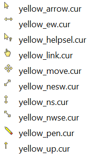

# YellowCursors
Yellow mouse cursor theme for Windows



## Installation

Installation is simple. Just copy the cursors from this repo into C:\Windows\Cursors
and then use the control panel to change the pointers.

But if you'd like to automate the process, here are two script options:

### Option 1 - Git

```powershell
# clone
git clone https://github.com/stevencohn/YellowCursors.git
Push-Location YellowCursors

# install
Copy-Item *.ani C:\Windows\Cursors\ -Force
Copy-Item *.cur C:\Windows\Cursors\ -Force
.\install.ps1

# clean up (optional)
Pop-Location
Remove-Item YellowCursors -Recurse -Force -Confirm:$False
```

### Option 2 - Native PowerShell

```powershell
# download
$src='https://github.com/stevencohn/YellowCursors/archive/master.zip'
$zip="${env:TEMP}\YellowCursors.zip"
$exp="${env:TEMP}\YellowCursors-master"
$ProgressPreference = 'SilentlyContinue'
[Net.ServicePointManager]::SecurityProtocol = [Net.SecurityProtocolType]::Tls12
Invoke-WebRequest -Uri $src -OutFile $zip
Expand-Archive -Path $zip -DestinationPath "${env:TEMP}\" -Force
Push-Location $exp

# install
Copy-Item *.ani C:\Windows\Cursors\ -Force
Copy-Item *.cur C:\Windows\Cursors\ -Force
.\install.ps1

# clean up
Pop-Location
Remove-Item $zip -Confirm:$False
Remove-Item $exp -Recurse -Force -Confirm:$False
```

### As Administrator

Of course, run both of these as administrator.

Notice that install.ps1 forces a dynamic reload of cursors.
This should work without requiring a logout/login or reboot.

Enjoy!

P.S. Yellow is (255,245,0)

P.P.S. A very nice ico, cur, ani editor: [Greenfish Icon Editor Pro](http://greenfishsoftware.org/gfie.php)
